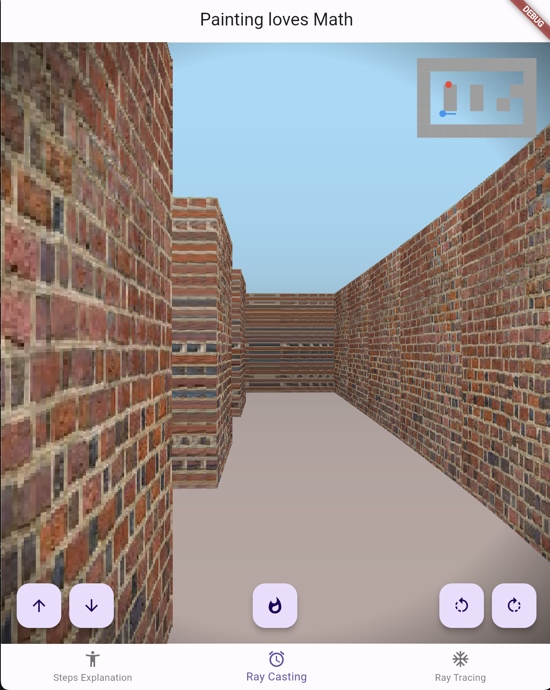
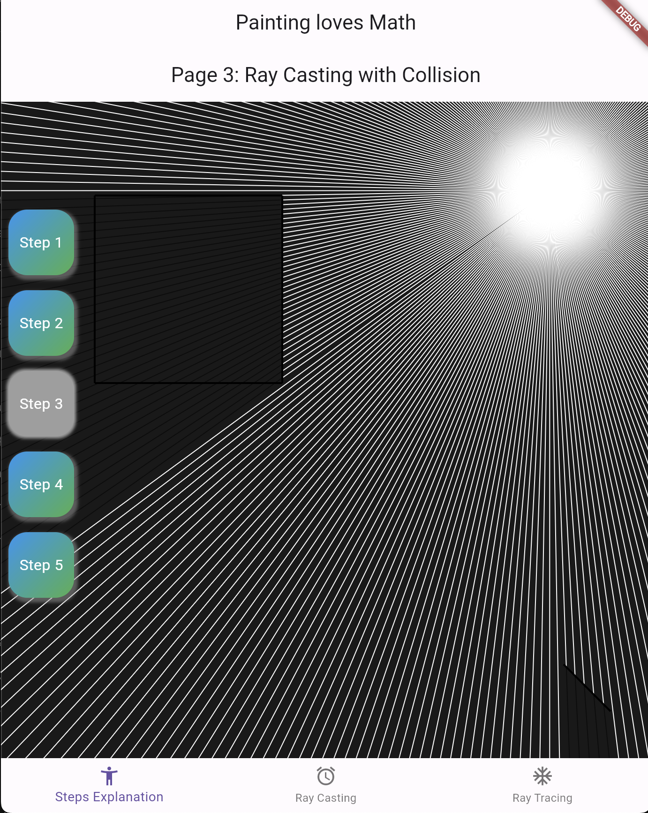
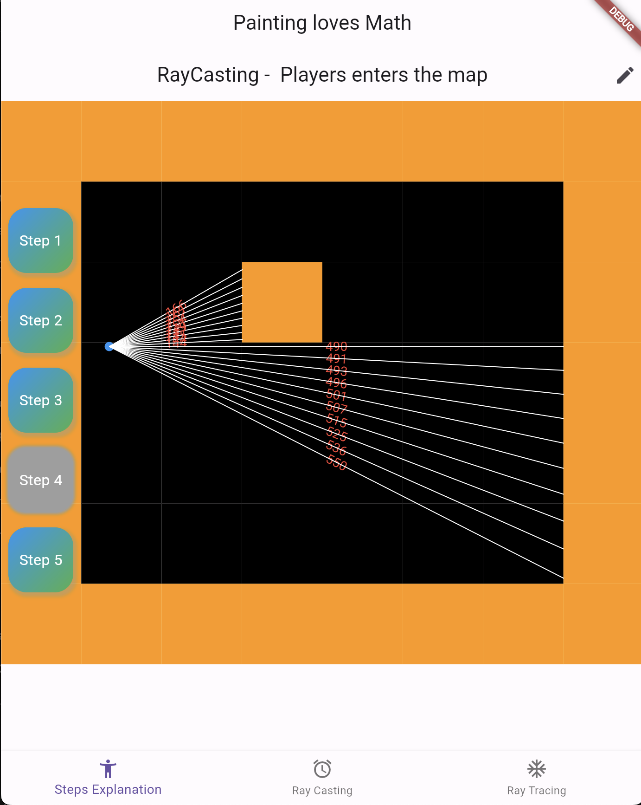

# Flutter Ray Casting and Ray Tracing Demo

A Flutter experiment implementing ray casting and ray tracing using pure Dart code. This project utilizes CustomPaint to render scenes and demonstrates the progression from basic 2D ray casting to a Doom-like 3D projection.

## Screenshots

## Table of Contents
- [Introduction](#introduction)
- [Features](#features)
- [Contributing](#contributing)
- [License](#license)

## Introduction
This Flutter project serves as an educational tool to understand and visualize the concepts of ray casting and ray tracing. Starting from simple 2D ray casting, it gradually builds up to more complex scenarios, including collision detection, shadows, reflections, and a basic 3D rendering similar to early 90s games like Doom.

The application is divided into multiple pages, each demonstrating a specific concept with increasing complexity. The use of `CustomPainter` allows for custom drawing on the canvas, making it ideal for rendering graphics in Flutter.

## Features
- 2D Ray Casting Visualization: Understand the basics of ray casting in a 2D environment.
- Collision Detection: See how rays interact with walls and obstacles.
- Shadows and Lighting: Visualize how shadows are formed when objects block light rays.
- Ray Tracing Introduction: Learn about reflections and how rays can simulate realistic lighting effects.
- Doom-Like 3D Projection: Experience a simple 3D rendering using 2D ray casting techniques.
- Interactive Controls: Move the light source or player position to see real-time updates in the scene.

## Contributing
Contributions are welcome! Feel free to open an issue or submit a pull request if you have any suggestions, bug reports, or improvements to the project.

## License
This project is licensed under the MIT License

Author: Jobehi (Youssef El Behi)

Feel free to reach out if you have any questions or suggestions!